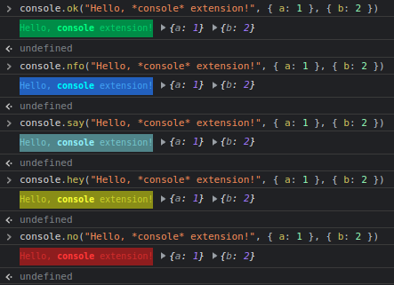
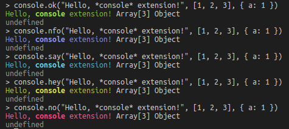

# @sounds.of.limbo/extensions
[](https://www.npmjs.com/package/@sounds.of.limbo/extensions)

[](https://badge.fury.io/js/@sounds.of.limbo%2Fextensions)

Useful extensions for basic JS prototypes

## Table of Contents
1. [Installation](#installation)
2. [Basic usage](#basic-usage)
3. [Available extensions](#available-extensions)
	1. [`Console`](#console)
    2. [`Number`](#number)
        1. [`padStart`](#padstart)
        2. [`limit`](#limit)
        3. [`formatThousands`](#formatthousands)
        4. [`pluralize`](#pluralize)
        5. [`asBytesToVerboseSize`](#asbytestoverbosesize)
        6. [`asSecondsToTime`](#assecondstotime)
        7. [`asSecondsToVerboseTime`](#assecondstoverbosetime)
4. [Helper types](#helper-types)
    1. [`SizeNames`](#sizenames)

## Installation
Simply install it using NPM:
```bash
npm install @sounds.of.limbo/extensions
```

## Basic usage
To apply specific prototype extension, you have to `import` corresponding file at some point of you application:
```tsx
// Assuming some React application
import React from "react"
import "@sounds.of.limbo/extensions/dist/Console"

export default class App extends React.Component {
    componentDidMount() {
        console.ok("Application *has been mounted*!")
    }

    render() {
        console.say("Application is being rendered")
        return <main>
            <h1>
                Hello, world!
            </h1>
        </main>
    }
}
```

Note that since corresponding file will be imported, extended prototype will be available **GLOBALLY**, including runtime (e.g. web browser's console). This is the basic side-effect of the prototype extension.

## Available extensions

### `Console`
Extended with five colorful log methods:
 - `say` - <span style="color:cyan;background:black;"> **cyan-colored** </span>, analogue of `console.log`
 - `nfo` - <span style="color:blue;background:black;"> **blue-colored** </span>, analogue of `console.info`
 - `ok` - <span style="color:lime;background:black;"> **lime-colored** </span>. Does not have analogues among basic console method. Typically being used for logging some success messages.
 - `hey` - <span style="color:yellow;background:black;"> **yellow-colored** </span>, analogue of `console.warn`
 - `no` - <span style="color:red;background:black;"> **red-colored** </span>, analogue of `console.error`

Despite some methods are marked as analogues, ***they are all still logging to the same level as `console.log` does***. This is due to only `console.log` supports color customizations.

Each method takes infinite number of parameters.
First parameter should be a string - this is the log message that will be colorfully customized. Other params will be logged as is.

You can make parts of the message to be written using **bold** font. To do this, just conclude desired part of message in asterisks (\*) (see screenshots below).

Here is how custom logs look like in the browser console:  


and here is an example from the terminal (Node.js):  


---

### `Number`

#### `padStart`
Analogue of `String.prototype.padStart`. Uses it under the hood.

```typescript
padStart(maxLength: number, padWith?: string) => string
```

| Argument | Type | Required? | Default value | Description |
| - | - | - | - | - |
| `maxLength` | `number` | **YES** |  | Maximum length of the resulting string |
| `padWith` | `string` | - | `"0"` | String to pad the initial string with |

---

#### `limit`
Limit current number to min and max values.
```typescript
limit(min: number, max: number) => number
```

Examples:
```typescript
(-1).limit(0, 10) // => 0
(5).limit(0, 10) // => 5
(10).limit(0, 10) // => 10
(11).limit(0, 10) // => 10
```

| Argument | Type | Required? | Default value | Description |
| - | - | - | - | - |
| `min` | `number` | **YES** |  | Minimum to limit value to |
| `max` | `number` | **YES** |  | Maximum to limit value to |

---

#### `formatThousands`
Places spaces each 3 numbers
```typescript
formatThousands() => string
```

Examples:
```typescript
(1000).formatThousands() // => "1 000"
(12345.6789).formatThousands() // => "12 345.6789"
```

---

#### `pluralize`
Use value to create pluralized string
```typescript
pluralize(singularForm: string, pluralForm: string, toFixed?: number) => string
```

Examples:
```typescript
(2).pluralize("test", "tests") // => "2 tests"
(1 / 3 * 2).pluralize("pound", "pounds", 2) // "0.67 pounds"
```

| Argument | Type | Required? | Default value | Description |
| - | - | - | - | - |
| `singularForm` | `string` | **YES** |  | Singular form of the word to be pluralized |
| `pluralForm` | `string` | **YES** |  | Plural form of the word to be pluralized |
| `toFixed` | `number` | - | `-1` | If the provided value is a number greater than or equal to 0, `Number.prototype.toFixed` will be applied to the number |

---

#### `asBytesToVerboseSize`
Treat value as bytes and return verbose siez string up to terabytes (TB)
```typescript
asBytesToVerboseSize(customSizeNames?: SizeNames) => string
```

Examples:
```typescript
(1024).asBytesToVerboseSize() // => "1 kB"
(12).asBytesToVerboseSize({ bytes: ["lost byte", "lost bytes"] }) // => "12 lost bytes"
```

| Argument | Type | Required? | Default value | Description |
| - | - | - | - | - |
| `customSizeNames` | [`SizeNames`](#sizenames) | - |  | Size names customizations |

---

#### `asSecondsToTime`
Treat value as seconds and return time string
```typescript
asSecondsToTime(separateDays?: boolean) => string
```

Examples:
```typescript
(42).asSecondsToTime() // => "00:42"
(3915).asSecondsToTime() // => "1:05:15"
(90088).asSecondsToTime() // => "25:01:28"
(90088).asSecondsToTime(true) // => "1 day 01:01:28
```

| Argument | Type | Required? | Default value | Description |
| - | - | - | - | - |
| `separateDays` | `boolean` | - | `false` | If there is more than 24 hours, whether there should be extra "days" label at the start or not. |

---

#### `asSecondsToVerboseTime`
Treat number as seconds and return verbose time string.
```typescript
asSecondsToVerboseTime() => string
```

Examples:
```typescript
(42).asSecondsToTime() // => "42 sec"
(3915).asSecondsToTime() // => "1 h 5 min 15 sec"
(90088).asSecondsToTime() // => "25 h 1 min 28 sec"
```

---

## Helper types

### `SizeNames`
Helper type that allows to specify custom singular and plural forms for specific size name.

```typescript
interface SizeNames {
	/**
	 * default is **byte, bytes**
	 */
	bytes?: [string, string]
	/**
	 * default is **kB, kB**
	 */
	kilobytes?: [string, string]
	/**
	 * default is **MB, MB**
	 */
	megabytes?: [string, string]
	/**
	 * default is **GB, GB**
	 */
	gigabytes?: [string, string]
	/**
	 * default is **TB, TB**
	 */
	terabytes?: [string, string]
}
```